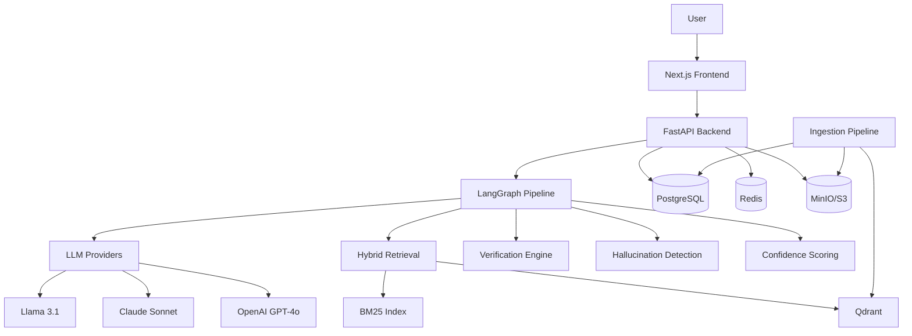

# MedVerify AI — Architecture

## System Overview

MedVerify AI is an evidence-grounded medical question answering platform that verifies every generated claim against retrieved medical literature.

## Component Diagram



## LangGraph Workflow

```
process_query → retrieve → generate → extract_claims → verify → score → END
```

Each node records latency and metadata in `pipeline_traces`.

## Retrieval Pipeline

1. **Dense**: BGE-large-en-v1.5 embeddings → Qdrant cosine search
2. **Sparse**: BM25 over tokenized corpus
3. **Fusion**: Reciprocal Rank Fusion (k=60)
4. **Rerank**: BGE-reranker-large cross-encoder

## Verification Pipeline

For each extracted claim:
1. Retrieve supporting evidence chunks
2. Compute entailment score (embedding cosine similarity)
3. LLM classification: Supported | Partially Supported | Unsupported | Contradicted
4. Highlight supporting text spans

## Confidence Formula

```
confidence = w1·retriever_similarity + w2·source_factor + w3·evidence_agreement
           + w4·verifier_confidence - w5·hallucination_penalty
```

Default weights: 0.25, 0.20, 0.20, 0.25, 0.10 (configurable via admin panel).

## Database Schema

| Table | Purpose |
|-------|---------|
| users | User accounts with RBAC |
| sessions | Refresh token records |
| documents | Medical literature metadata |
| document_chunks | Chunked text for retrieval |
| embeddings | Vector metadata (vectors in Qdrant) |
| queries | User questions and answers |
| claims | Atomic factual claims |
| claim_evidence | Evidence per claim |
| citations | Formatted references |
| confidence_breakdowns | Score components |
| pipeline_traces | Per-node execution traces |
| evaluations | RAGAS/DeepEval results |
| benchmarks | Multi-model benchmark runs |
| benchmark_runs | Per-model benchmark metrics |
| audit_logs | Security audit trail |

## API Endpoints

| Method | Path | Description |
|--------|------|-------------|
| POST | /api/v1/ask | Medical Q&A |
| POST | /api/v1/extract-claims | Claim extraction |
| POST | /api/v1/verify | Evidence verification |
| POST | /api/v1/evaluate | RAG evaluation |
| POST | /api/v1/benchmark | Model benchmarking |
| GET | /api/v1/sources | Source explorer |
| GET | /api/v1/metrics | System metrics |
| GET | /api/v1/health | Health check |
| GET | /api/v1/models | Available LLMs |

## Observability

- **Logging**: structlog JSON format
- **Metrics**: Prometheus (request count, latency, hallucination rate)
- **Tracing**: OpenTelemetry with configurable exporters
- **Health**: Multi-service health checks (DB, Redis, Qdrant)
